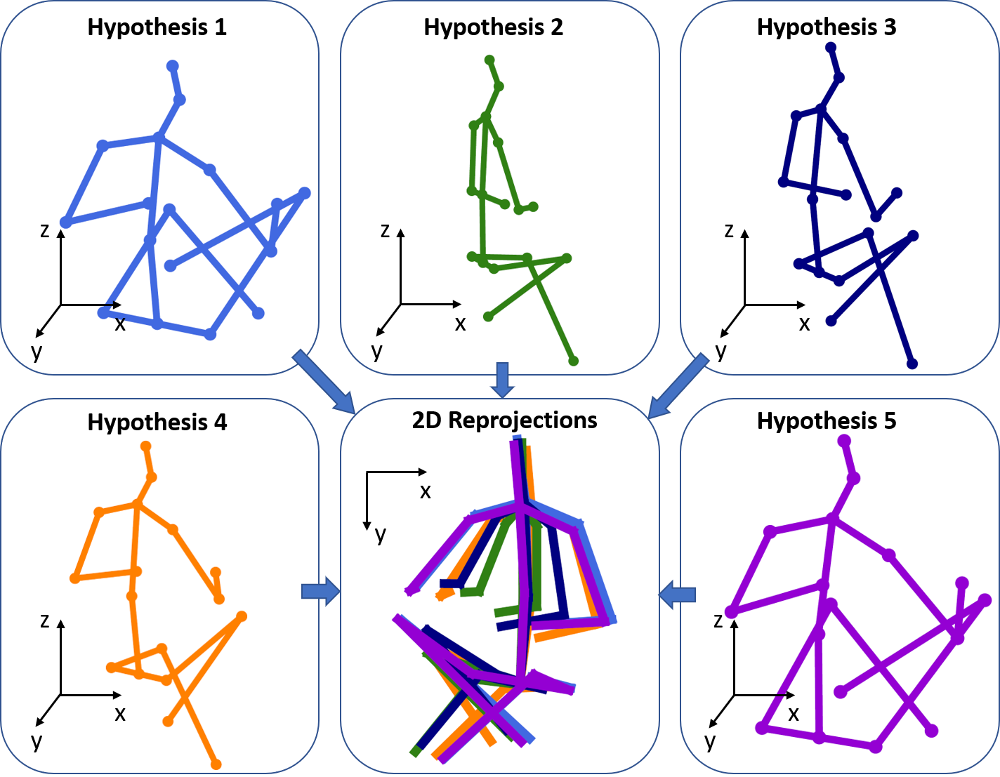
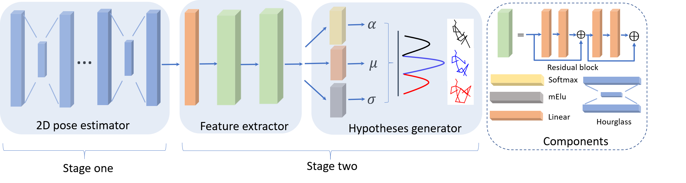

# Generating-Multiple-Hypotheses-for-3D-Human-Pose-Estimation-with-Mixture-Density-Network

**About**

This is the source code for the paper

Chen Li, Gim Hee Lee. Generating Multiple Hypotheses for 3D Human Pose Estimation with Mixture Density Network. In CVPR2019. 

We argue that 3D human pose estimation from a monocular/2D-joint input is an iverse problem where multiple solutions can exist.


We use a two-stage approach to generate multiple 3D pose hypotheses. The 2D joints are firstly detected from the input images in the first stage, followed by a feature extractor and hypotheses generator to generate 3D pose hypotheses.



For more details, please refer to our paper on [arXiv](https://arxiv.org/pdf/1904.05547.pdf).

**Bibtex:**
```
@InProceedings{Li_2019_CVPR,
author = {Li, Chen and Lee, Gim Hee},
title = {Generating Multiple Hypotheses for 3D Human Pose Estimation With Mixture Density Network},
booktitle = {The IEEE Conference on Computer Vision and Pattern Recognition (CVPR)},
month = {June},
year = {2019}
}
```

**Dependencies**
1. h5py--to read data
2. Tensorflow 1.8

**Train**

Get this code:
```
git clone https://github.com/chaneyddtt/Generating-Multiple-Hypotheses-for-3D-Human-Pose-Estimation-with-Mixture-Density-Network.git 
```
Download the 2D detections of [Human3.6 dataset](https://github.com/una-dinosauria/3d-pose-baseline).

Run:
```
python predict_3dpose_mdm.py --train_dir <specify your training folder>
```
You can also change the arguments during training. For example,you can train with one or two missing joint(s) randomly selected from the limbs by run:
```
python predict_3dpose_mdm.py --miss_num <specify how many joints are missing>
```
You can also change other arguments in the predict_3dpose_mdm.py in a similar way.

 **Test**

Down our [pretrained model](https://drive.google.com/open?id=1ndJyuVL-7fbhw-G654m5U8tHogcQIftT)
 
To test our pretrained model, run:
```
python predict_3dpose_mdm.py --test True --load 4338038 --load_dir ../Models/mdm_5_prior/ (model with the dirichlet conjucate prior)
```
or run:
```
python predict_3dpose_mdm.py --test True --load 4679232 --load_dir ../Models/mdm_5/ (model without the dirichlet conjucate prior)
```
**Visualize**

To visualze all the five 3D pose hypotheses generated by our model, run:
```
python predict_3dpose_mdm.py --sample True --load 4338038 --load_dir ../Models/mdm_5_prior/ 
```


**Acknowledgments**

The pre-processed human3.6 dataset and the feature extractor of our model was ported or adapted from the code by [@una-dinosauria](https://github.com/una-dinosauria/3d-pose-baseline).
